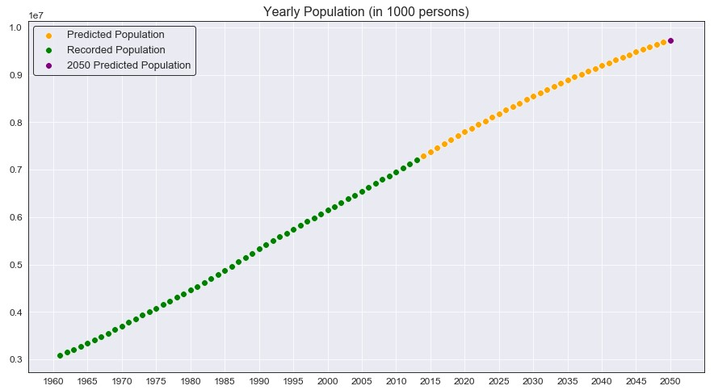
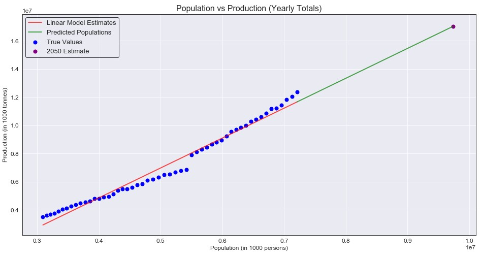
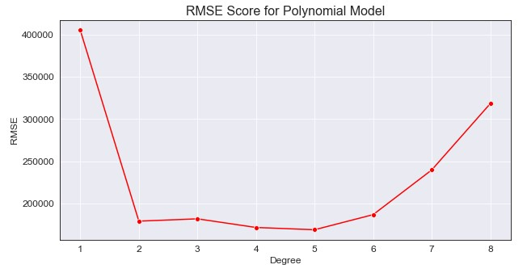
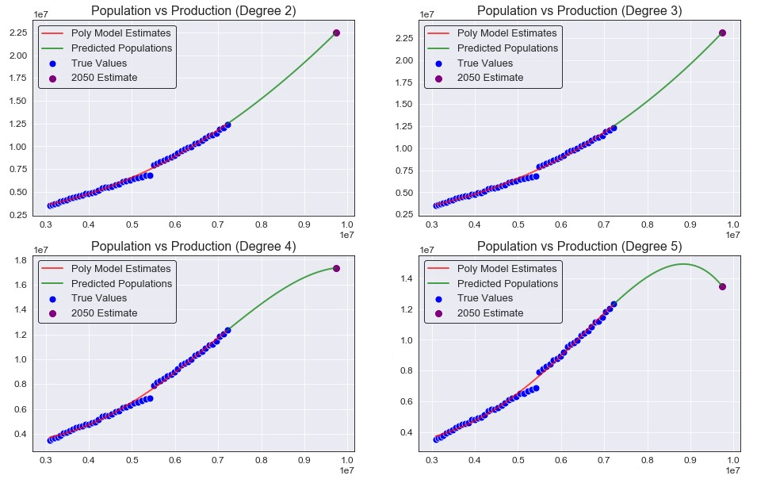

> [Original GitHub Repository](https://github.com/dhelms1/food_production)
>
> *Note*: An in-depth data exploration section was also created, but will not be explored in this post. I will mainly focus on the modeling section, please refer to the GitHub link above for the *DataExploration.ipynb* notebook.

# The More The Merrier... Right?
The current world population is nearly 7.8 billion people, and this number is estimated to rise to around 9.7 billion (or higher) in the year 2050. This means within the next 30 years, we will need to feed two billion more people without sacrificing the planet. This means we will need to increase our crop production in order to feed that growing population. Agriculture is one of the greatest contributors of global warming, with farming consuming immense amounts of our water supplies and leaving major pollutants as its byproduct from fertilizer runoff. This leads to the question, how do we supply the necessary amount of food for a growing world population without sacrificing the climate of our planet? This was the goal for my project, to use data from Production & Population from 1963 to 2013 to train a model that could then be used to predict the global food production necessary from 2014 to 2050, with an emphasis on the year 2050. 

## The Data
Two different data sets were used for the training data: one coming from [Kaggle](https://www.kaggle.com/dorbicycle/world-foodfeed-production) that contains information on yearly production for 174 countries and the other coming from the [Food and Agriculture Organization (FAO)](http://www.fao.org/faostat/en/#data/OA) website that contains the annual population for each country. 

- **Production**: This data set contains the yearly food production of 115 food items for 174 countries, spanning from 1961 to 2013. It also is broken down into food and feed categories, which represent human and livestock consumables (respectively). The data will be summed across each year (column) in order to get a rough estimate of the global production for every year. This part of the data will be our dependent variable that will be predict from our population data.
- **Population**: This is an Annual Population Report obtained through FAO that contains the estimated population for 245 countries from 1961 to 2018. An important note is that this data set contains 71 more countries than the Production data set, but will be kept in for total population purposes. All years after 2013 will be dropped as well since the Production data stops there, and no further production data can be estimated and evaluated.

One more data set will be created for testing purposes, the estimated population from 2014 to 2050. Even though the current year is 2021, the Production data does not have any values after 2013 and so all further years will need to be predicted. This data comes from the [Worldometer](https://www.worldometers.info/) website which tracks live population counts, past population data, and future predictions. Data from this website is pulled from 2014-2020 (actual) and 2021-2050 (estimated) and put into a NumPy array.

*Note: Population is measured in "1000 persons" and Production is measured in "1000 tonnes"*.

``` Python
pop_est = [7210845.848 , 7295290.765, 7379797.139, 7464022.049, 7547858.925, 7631091.040, 7713468.100, 7794798.739, 
           7874965.825, 7953952.567, 8031800.429, 8108605.388, 8184437.460, 8259276.737, 8333078.316, 8405863.295, 
           8477660.693, 8548487.400, 8618349.489, 8687227.850, 8755083.431, 8821862.661, 8887524.213, 8952048.940, 
           9015437.653, 9077693.676, 9138828.468, 9198847.240, 9257745.535, 9315508.050, 9372118.186, 9427555.367, 
           9481803.274, 9534854.828, 9586707.986, 9637357.637, 9686800.357, 9735033.990]
```

# Predicting Production: They Grow Up So Fast



Although the predictions for every year from 2014 to 2049 are just as important, the main focus is the 2050 prediction (marked as the purple point above). As we can see, from an initial plot it seems that the data is mostly linear. It does seem like the population growth may be slowing down as 2050 approaches, but again this is just estimated and not the true value. This brings me to ask; does this mean the population will peak in 2050 and begin to plateau? Or will it continue to grow and pass 10 billion?

## The Simple Linear Model
Okay, so population seems to be mostly linear. But does this idea stay true when we plot production against population? 



Eh, not so much here. Yes it is somewhat linear, but I didn't expect a completely straight line to be the best model (and it definitely wasn't). So how bad was it really? Well I decided to evaluate the model's based on **RMSE**, and the RMSE for the initial model was 405,017.06 and yes that seems large, but the numbers we are working with here are also extremely large (so maybe it isn't so bad). The main purpose of this model was not to have a high accuracy right off the start, but rather to have a base value for the RMSE and ensure that our other models are improvements over this one. So how do we improve this model? 

## The Polynomial Model
Ah yes, linear regression but with curved lines. The whole idea behind these models is that we can manipulate the x-values to better fit the data and estimate our target y-values. However, we also have to consider the curve after the training data finishes (2013). If we square the x value, it may fit better but growth past our last year may grow extremely fast and not properly model the data. If we cube the x value, our data may grow even faster and fit worse as the years increase. To help determine this, I will evaluate multiple models on their RMSE values to help chose a subset of values to modify the population data.

### Determining the Degree

``` Python
rmse_scores = []
degree_range = np.arange(1,9)

for deg in degree_range:
  poly_features = PolynomialFeatures(degree=deg)
  X_poly = poly_features.fit_transform(x_train)
  poly_model = LinearRegression().fit(X_poly, y)
  train_preds = poly_model.predict(X_poly)
  rmse = round(np.sqrt(mean_squared_error(y, train_preds)), 2)
  rmse_scores.append(rmse)
```


We can see a degree of 1 represents our base model, but degrees 2 to 5 seems to minimize the RMSE the best. We will want to train a polynomial model using those degrees, compare their RMSE as well as their prediction patterns for the future, and determine which model best suits our data. This may mean having a higher RMSE, but we are more focused on the predicted production rather than a minimal error in this case.

### The Models
``` Python
for degree in deg_range: # [2-5]
  poly_feat = PolynomialFeatures(degree=degree)
  X_poly = poly_feat.fit_transform(x_train) # Manipulate x by given degree
  
  poly_model = LinearRegression().fit(X_poly, y)
  poly_2014_2050 = poly_feat.fit_transform(pop_)
  
  yhat = poly_model.predict(X_poly) # Predict 1963 to 2013
  future_yhat = poly_model.predict(poly_2014_2050) # Predict 2014 to 2050
  
  # Append values to be plotted
  rmse_scores.append(round(np.sqrt(mean_squared_error(y, yhat)), 2))
  preds_2050.append(round(future_yhat[-1],3))
  future_preds.append(future_yhat)
  poly_train_preds.append(yhat)
```



| Degree | RMSE      | 2050 Production Estimation |
| ------ | --------- | -------------------------- |
| 2      | 179427.41 | 22463820.97                | 
| 3      | 182169.96 | 23084034.55                | 
| 4      | 171969.60 | 17341906.93                | 
| 5      | 169272.95 | 13500278.99                | 

Just from a quick glance, we can see that we cut the original RMSE values by over 50%. It also seems that each model has a very close RMSE to one another (max difference of around 13,000). However, the 2050 estimate is where the models become extremely different with a maximum of 22.4 billion tonnes and a minimum of 13.5 billion tonnes (the above prediction are measured in 1000 tonnes and I multiplied them out to get these numbers). So just a slight difference, but how do we know which value is correct? The simple answer is that we don't, but we can look to professional who study these concepts for some guidance on how much production we need to support the 2050 population.

### So what exactly do we want to predict?
This is where the goal of our model gets a little more complicated. What exactly is the necessary production needed to support the 2050 population? The answer to this depends on who you ask. 

- From the [World Resources Institute](https://www.wri.org/insights/how-sustainably-feed-10-billion-people-2050-21-charts), they predict that we needs an increase of around 56% in production from 2010 to 2050 in order to *sustainably* feed 10 billion people. The 2010 global production, from our data set, was 11,445,072 (in 1000 tonnes). Following this idea, that means we need to produce 17,854,312.32 (in 1000 tonnes) total for the estimated 2050 population. This seems to follow the degree 4 polynomial model, which estimated a production of 17,341,906.93 (in 1000 tonnes).

- From the [United Nations](https://www.un.org/press/en/2009/gaef3242.doc.htm#:~:text=Food%20production%20must%20double%20by%202050%20to%20meet%20the%20demand,a%20panel%20discussion%20on%20%E2%80%9CNew), they predict that global food production must double in order to support the global population. Given that the article was written in 2009, with a global production of 11,211,891 (in 1000 tonnes) for out data set, this means we need to produce 22,423,782 (in 1000 tonnes) for the year 2050. This idea follows the degree 2 model (almost exactly) with an estimated production of 22,463,820.97 (in 1000 tonnes).

A difference in 5 billion tonnes of production, the true total global production needed for 2050 is difficult to estimate. Despite not being the lowest RMSE for the models, these 2 most accurately depict what has been estimated by professionals. Choosing which model is correct will be more of a challenge, since there is no real way to determine what the actual growth will be in the future (global events, pandemics, food supply, etc.). However, these two models are good indicators of a possible future that we could see.

# Conclusion
In an attempt to keep this post short, I did skip over the majority of the code as well as another section on clustering countries based on their production. If you really want to know, the main producers are China, India, and the United States of America (and it's not even a close tie between the remaining countries). But the main purpose of this post was to explore the production needed for the 2050 population. Although it's difficult for me to make a strong conclusion about which model I think best fits the data, it's always better to overprepare rather than being underprepared. The second degree model, although growth will only continue to increase after 2050 even faster given the graphs curve, is the one I would feel most confident backing up. This project taught me a lot, not only about where my food was coming from but also about where it is going to need to come from and how we all need to do our part to help sustainably increase production. I can't emphasis enough checking out the *DataExploration.ipynb* on the original Github link, there are a ton of graphs on production and items that I had no idea about and really enjoyed exploring. 


