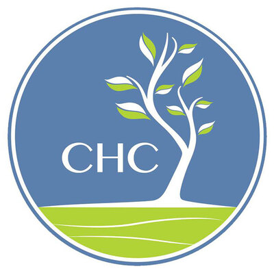

# Introduction
6/1/2021 marks the first day of my Research Intership with the CHC (even though I'm writing this almost 2 weeks later) and I have some mixed emotions about how I feel about it. I'm not saying I don't like the program (it's quite the opposite), I'm beyond grateful for the opportunity. But I am nervous. Will I be able to keep up with everyone whose already been working on the project? What if I don't deliver everything I need to at the end of the program? Am I going to be able to learn everything or will I fall behind? There's a lot of questions I keep asking myself, the programs use of R and Data Analysis are new to me. I work on Deep Learning projects using Python (*quick shameless plug: go check out some other posts on my website about these projects*), and there isn't much analysis for images or text data (some, but not to the extent of a survey with over 250 features). All these new methodologies have me feeling a little overwhelmed, but I'm also excited. 

I love learning (I've been in college for almost 6 years so I guess I better love it) and this is a summer of learning, but without the stress of grades. No midterms, no finals, no surprise quizzes on the one topic you decided to skip reading. I'm excited to see where the program takes me and how I will develop both as a person and a researcher.

## What exactly is the Internship?
For the summer, I'll be working on the second version of the Basic Needs Student Success Survey (BNS3) and helping to prepare the third. The first version was aimed towards Chico State students, the second was 3 CSU schools, and the third will be aimed towards getting it distributed across California. Pulled from the [BNS Website](https://chicocalfresh.github.io/bns-website/index.html): 

> The purpose of this cross-sectional pilot study was to create a tool that identifies student perception of the impact of receiving CalFresh assistance on their health, nutrition, cooking confidence, time management and academic performance.

My main purpose will be analyzing the findings from the second version of the survey and creating a website to present these findings (similar to the above current BNS Website). In no particular order I have three main personal goals for this program: become familiar with research environments/procedures that I can take with me to Grad School, master R and Data Analysis techniques, and finally use the tools learned during the program by applying them to mini projects.

# Goal #1: Learn Research Environments/Procedures
It would be an understatement to say I'm not the most well-versed when it comes to the terminology of academia (I actually had to look up what well-versed means). English is my only language and I still barely speak that correctly, hence why I became a Math major. But my goal for this summer is to learn both the language and methods for the area of research. As I plan to go onto grad school and will most likely need to complete some type of final research project, this program is the perfect opportunity to learn the necessary tools I will need before I enter higher education.

Even just from the training I had to, there were a lot more procedures than I previously thought were in a research environment. Publishing credits, data protection, data storage, ethical procedures, review boards, population selection. All these concepts that have to be considered while creating a research topic that I had never even thought about. My goal is to learn more about these, especially as I help prepare to get the next version of the survey ready for statewide distribution, and to carry forward the information I learn with me. I think the exposure that I'll get throughout this summer will help prepare me to see what the next few years of my life will look like during grad school.

# Goal #2: Master R & Data Analysis
When I first started on my machine learning journey there were two main languages that everyone talked about: R and Python. And just like everyone else who begins their machine learning journey, I kept asking "which one is the best to learn?". Everyone said it was personal choice, and that Python seemed to be growing more popular with all the machine learning libraries it has. On top of this it seemed that industry jobs wanted Python over R experience (from what I found) and that R was mainly for academia, which at the time I never though I would go into. But now here I am, working the entire summer doing academic research using R and I guess I'll finally get the answer to my initial question of which language is the best to learn.

My goal for this program is to master R and its libraries. Whether it be from helping update the data cleaning script, creating both this website and the final BNS pilot 2 website using RStudio, or from the Exploratory Data Analysis I'll be doing on the survey data. I guess I do have a bit of a headstart since I've used R in two of my class (Sampling Methods & Applied Statistics II), but nothing to the extent of what I expect to be doing this summer. I'm excited to see how I can take the skills I've learned from Python and transfer them over the R. What I'm not excited about is accidently writing Python code inside of R and getting execution errors (and believe me it's already happened a lot). I'm always up for a new challenge, and through both the research project and my outside personal mini-projects with R, I plan to acheive my goal of mastering R.

# Goal #3: Applying What I've Learned (#tidytuesday)
Speaking of mini-projects, #tidytuesday is the main way I plan to apply what I'm learning throughout the summer to material outside of the research project. The entire purpose behind [TidyTuesday](https://github.com/rfordatascience/tidytuesday) is:

> A weekly data project aimed at the R ecosystem. As this project was borne out of the `R4DS Online Learning Community` and the `R for Data Science textbook`, an emphasis was placed on understanding how to summarize and arrange data to make meaningful charts with `ggplot2`, `tidyr`, `dplyr`, and other tools in the `tidyverse` ecosystem.

No modeling, no data processing, no evaluation. Just pure Data Exploration. Given that one of the main purpose's of my research project is EDA, this is the perfect opportunity for me to become familiar with R's libraries for graphing and data transformation. I've already completed one project, discussing [TV's Golden Age](https://derekhelms.netlify.app/post/tvgoldenage/) and whether or not it was real, and I've already learned a ton from it. Using **dpylr** for filtering and feature engineering almost made me love it more than Python's version of it. 

My goal is to set aside around an hour per day for Wed/Thrs/Fri in order to work on one of these projects. I'm aiming to completed one every two weeks (so around 4-5 hours working on the actual project an around 1-2 hours creating/posting on this website). Obviously this is just extra work outside of the main project, so some weeks I may not work on TidyTuesday at all if I have too much research work to complete. But I see this as a great opportunity for me to expose myself to the area of EDA which I am not too familiar with. 

