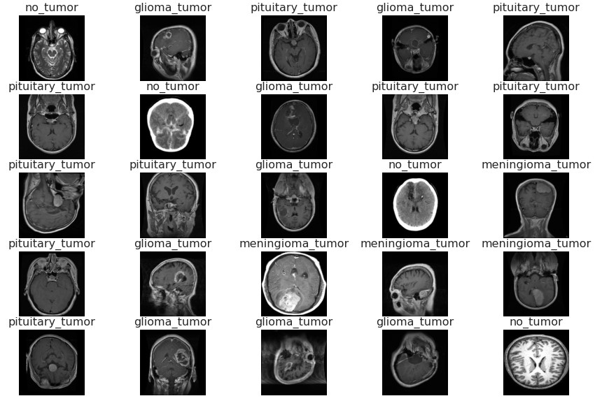
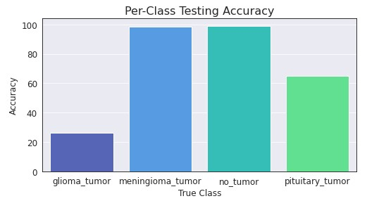
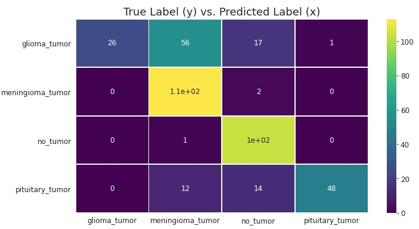

# Introduction  
MRI scans are one of the main tools used for analyzing tumors in the human brain. Huge amounts of image data are generated through these scans, which need to be examined by a radiologist, and can be susceptible to diagnosis error due to complex MRI scans. This is where the application of neural networks come in. Through Convolutional Neural Networks, we are able to process these scans in order to extract low level features that can help us correctly classifying and diagnose brain tumors. The purpose of this project is to deploy a deep learning model using Amazon SageMaker that can accurately classify MRI scans of brain tumors into four different categories:  

- **Glioma** - a tumor made of astrocytes that occurs in the brain and spinal cord.
- **Meningioma** - a usually noncancerous tumor that arises from membranes surrounding the brain & spinal cord.
- **None** - no tumor present in brain.
- **Pituitary** - a tumor that forms in the pituitary gland near the brain that can change hormone levels.  


# Acquiring & Processing the data
The first step in this project was acquiring the images necessary for training and testing, which originally came from [**Kaggle**](https://www.kaggle.com/sartajbhuvaji/brain-tumor-classification-mri) but was cloned from the original [**GitHub Repository**](https://github.com/sartajbhuvaji/brain-tumor-classification-dataset) hosted by *Sartaj Bhuvaji*. Initially, 2870 training images and 394 testing images were present in the data set. The training images were further split into training/validation sets, with an 80/20 split resulting in 2296 training and 574 validation images. 

*NOTE: I now question whether randomly flipping up/down was appropriate for medical imaging (since most will be inputted the correct way), but it did not seem to negatively effect the results so I left it in. Going forward, possibly avoiding augmenting the images in a way that is very uncommon could be more beneficial.*

``` Python
train_dataset = tf.data.Dataset.from_tensor_slices((X_train, y_train))
val_dataset = tf.data.Dataset.from_tensor_slices((X_val, y_val))

def cast(image, label):
    image = tf.convert_to_tensor(image, dtype=tf.uint8) # convert to tensor
    return image, label

def train_augment(image, label):
    seed = np.random.randint(1, 150, size=1)[0]
    image = tf.convert_to_tensor(image, dtype=tf.uint8) # convert to tensor
    image = tf.image.random_flip_up_down(image, seed=seed) # random flip
    image = tf.image.random_flip_left_right(image, seed=seed) # random flip
    return image, label
    
train_dataset = (
    train_dataset
    .map(train_augment, num_parallel_calls=AUTOTUNE)
    .prefetch(AUTOTUNE)
    .shuffle(buffer_size=len(X_train))
)

val_dataset = (
    val_dataset
    .map(cast, num_parallel_calls=AUTOTUNE)
    .prefetch(AUTOTUNE)
)
```



Although these data sets came separated into subdirectories, which could have been uploaded directly to S3 and read using the ImageDataGenerator function in TensorFlow, I decided to convert them into TensorFlow Datasets and then into TFRecord Files. The training images were also augmented using rotations and initially, normalization. Little did I know how much of an issue this one step would become during training...

### The Struggle of Never Reading
Side note, if there's one thing this project taught me it was to read the documentation. I had chosen the EfficientNet architecture for the model, which I now know handles normalization within the architecture, but I had skipped reading this part. 2 days and countless failed training runs later, and I still couldn't figure out why my images (which were currently being normalized) were resulting in 99% train accuracy and 10% validation accuracy. That is, until I opened the [**EfficientNet**](https://keras.io/api/applications/efficientnet/) documentation and saw the fourth line:

> EfficientNet models expect their inputs to be float tensors of pixels with values in the [0-255] range.

#


I don't know if anything else could describe the feeling when I saw that line. Hours of downloading and importing the project into Google Colab to step through the training process... Hours of reformatting my TFRecord files thinking I was mislabeling my data... Hours of reading Medium articles on SageMaker and TensorFlow training setups... But it's totally fine. At least my file size was reduced a lot from removing the normalization so hey, one win for me I guess. 

# Modeling
Alright, enough with my rant. Now we can finally get to the good part, creating the TensorFlow model. As stated previously, the EfficientNet architecture was chosen for the model, more specifically the B0 architecture. Looking into the *scripts/model.py* directory we can see that the output was replaced with a new Dense layer to handle our 4 classes: 

``` Python
from tensorflow.keras.applications import EfficientNetB0
from tensorflow.keras import layers, models
from tensorflow.keras.optimizers import Adam
IMG_SIZE = 224

def EfficientNetClassifier():
    effnetb0 = EfficientNetB0(weights='imagenet', include_top=False, input_shape=(IMG_SIZE, IMG_SIZE, 3))
    model = layers.GlobalAveragePooling2D()(effnetb0.output)
    model = layers.Dropout(0.3)(model)
    model = layers.Dense(4, activation='softmax')(model)
    model = models.Model(inputs=effnetb0.input, outputs=model)
    model.compile(optimizer='Adam', loss='categorical_crossentropy', metrics=['accuracy'])
    return model
```

Class weights were also computed and uploaded to the S3 bucket since there is a slight difference in the no_tumor class compared to the other three and we need the model to learn equally from each class. They are as follows:

| Class      | Weight     | 
| ---------- | ---------- | 
| Glioma     | 0.86445783 |
| Meningioma | 0.85928144 |
| No Tumor   | 1.81072555 |
| Pituitary  | 0.88717156 |

Both Early Stopping and Learning Rate Reduction are implemented for the model, with learning rate being reduced 3 times and early stopping occurring at epoch 16 when validation loss plateaued.  

``` Python
early_stop = EarlyStopping(monitor='val_loss', mode='min', patience=5)
lr_reduction = ReduceLROnPlateau(monitor='val_loss', patience = 2, verbose=1, factor=0.2, min_lr=0.000001)
```

## Training

``` Python
model.fit(x=train_dataset,
          epochs=epochs, 
          validation_data=val_dataset,
          verbose=2,
          class_weight=class_weights,
          callbacks=[early_stop, lr_reduction])
```

On epoch 1, the initial training accuracy was 85.1% with a validation accuracy of 62.37%. After epoch 5, 13, and 15 the learning rate was reduced from an initial value of 0.001 to a final value of 0.000008. Early stopping ended our models training after epoch 16, where the validation loss plateaued around 0.044. The final results from training are:

| Dataset    | Loss   | Accuracy |
| ---------- | -----  | -------- |
| Training   | 0.0036 | 99.91%   |
| Validation | 0.0431 | 98.61%   |

With such a high training accuracy, I would be skeptical that the model is overfitting. But since our validation accuracy is within 1.5% of the training accuracy, it leads me to think that the model is performing well. This will be either confirmed or denied in the testing results section depending on the accuracy of the model of predicting with new data. *Note: The final model is saved to the default S3 bucket, which will be loaded back into the main notebook and used for predicting.*

## Testing
Testing images/labels (394 total) were loaded and saved into numpy arrays, which were then flattened and sent to the endpoint for predicting. The maximum probability from the predicted array was then taken and converted back into a string label corresponding to the true label. 

``` Python
def process_image(image):
    image = tf.expand_dims(image, 0)
    input_data = {'instances': np.asarray(image)}
    return input_data
  
def predict_test_data(test_img):
    preds = []
    probs = []
    for img in tqdm.tqdm(test_img):
        input_data = process_image(img)
        y_pred = predictor.predict(input_data)
        probs.append(max(y_pred['predictions'][0]))
        preds.append(string_labels[np.argmax(y_pred['predictions'][0])])
    
    return preds, probs
```

With such a high training/validation accuracy, I expected the testing accuracy to have a similar result. (NOTE: refer to *test_results* directory to see the dataframe containing each test images predicted probability/label, true label, and if it was correct). However, the final results were:

| Dataset   | Accuracy |
| --------- | -------- |
| Testing   | 73.86%   |

With these results, I'm skeptical that the model is indeed overfitting. With ~25% difference in training and testing accuracy, we may need to re-evaluate how we are augmenting images and ensure that there are no duplicates in the train/validation sets. However, further exploration and looking at other people's projects, we can see the test accuracy we achieved is in on the mid-high end (which is somewhat reassuring I think?). 


# Final Results
Due to the large difference in train/test accuracy, further exploration was needed on these incorrectly predicted observations. Looking at the testing accuracy for each class, as well as the probabilities for the incorrect predictions, we get the following:

 

Looking at the accuracy per class, we can see that *Meningioma* and *No Tumor* are performing close to 100% accuracy. However, *Glioma* and *Pituitary* are not performing very well at all, with around 30% and 65% accuracy (respectively). If we looked the the probabilities associated with these incorrect predictions, we can see that most are extremely confident in their predictions. This leads me to wonder if something within the dataset is causing the issues, especially with everyone else having the same issues from what I can tell.

Finally, looking at a confusion matrix, we can see where these mislabeled predictions are:



- **Glioma** - it seems the majority of Glioma tumors are being classified as Meningioma (56), followed by the true label Glioma (26), followed by No Tumor (17), and finally Pituitary (1). 
- **Pituitary** - It seems the majority of Pituitary tumors are being classified as the true label Pituitary (48), followed by No Tumor (14), and finally Meningioma (12).

## Conclusion
From start to finish, this project was a learning experience that taught me more than I expected. As my first real project using TensorFlow, I feel there are areas that I could improve on (maybe going straight to TFRecord instead of the intermediate step of a TFDataset) but overall I'm happy with my results. Getting a training/validation accuracy of over 99% was very nice, and although testing accuracy was much lower I have suspicions that it may be an issues with the labeling/images rather than overfitting (given other people's similar results). Overall, this project taught a lot of crucial skills that I will carry onto my future projects. But none more important than READ THE DOCUMENTATION.


## Resources
Below is a list of resources used throughout this project, including both documentation and articles that, help with ideas/formatting of my TensorFlow code and made the project possible:

- [Train a TensorFlow Model in Amazon SageMaker](https://towardsdatascience.com/train-a-tensorflow-model-in-amazon-sagemaker-e2df9b036a8) - Jun M.
- [TFRecord and Image Data Example](https://www.tensorflow.org/tutorials/load_data/tfrecord#walkthrough_reading_and_writing_image_data) - TensorFlow Documentation
- [How to train an Image Classifier on TFRecord files](https://towardsdatascience.com/how-to-train-an-image-classifier-on-tfrecord-files-97a98a6a1d7a) - Karan Sindwani
- [Working with TFRecords and tf.train.Example](https://towardsdatascience.com/working-with-tfrecords-and-tf-train-example-36d111b3ff4d) - Cihan Soylu
- [Image classification via fine-tuning with EfficientNet](https://keras.io/examples/vision/image_classification_efficientnet_fine_tuning/) - Keras API


