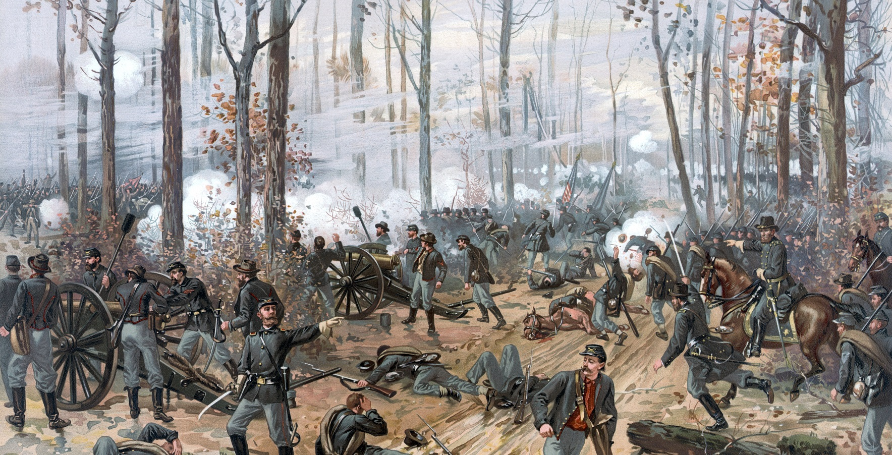

# Alright, I'll admit it...
It sounded a lot cooler in my head. "Battle of the Learning Methods: Statistical vs Machine Learning". Man vs. Machine (well not really, but you get the point). A test of speed, strength, learning, and maybe a little bit of overfitting. Maybe it's just me that's excited about the project, but I finally get to implement what I learn in school against what I do in my free time. This term I took both Sampling Methods and Applied Statistics II, and this brought me to think if I could create a project that implemented the material from those classes and my knowledge of Machine Learning? This project was the answer. 

Stroke is the third leading cause of death in the United States, with over 140,000 people dying annually. Each year approximately 795,000 people suffer from a stroke with nearly 75% of these occurring in people over the age of 65. Using medical record information (age, gender, BMI, smoking, diseases, etc.) we will create models that can accurately predict whether or not a patient has had a stroke. The goal for this project will be to explore the data and find any correlations between features and the response variable stroke that will allow us to engineer new features for the data. After doing this, we will make a comparison between Statistical Modeling and Ensemble Modeling to see which we are able to achieve better results with. *Note: models will be evaluated by an F-Beta and Recall score since avoiding a missed diagnosis is the main focus.*


# Data Exploration & Feature Engineering
The data originated from the [Kaggle](https://www.kaggle.com/fedesoriano/stroke-prediction-dataset) repository for stroke prediction. There are 11 features that were recorded for 5110 observations. Personally I like to perform feature engineering while doing my EDA so that I can create these new features while the ideas are fresh in my mind. From importing the data, our initial data set has the following features:

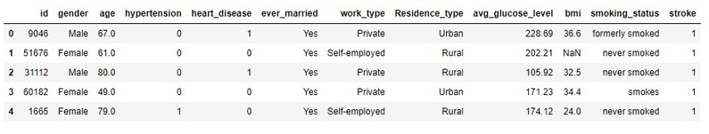

However, the *id* feature is just a unique identifier, so it can be dropped from the data set.

## BMI (Body Mass Index)
From the initial exploration, I found that the only feature that had missing values was *bmi* (with 201 na's). Before filling the missing values, we have the following distribution for *bmi*:
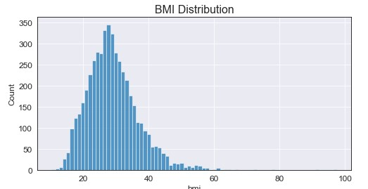

Two important notes here: the data seems to be somewhat normally distributed and we seem to have extreme values for bmi. To handle the missing values, I decided to fill them with the median value +/- random noise between [1,4]. Do I have a logical explanation for why I did this? Of course not, but filling with the median only increased a single value being present, where adding the random noise allowed for a more "even" distribution around the median. On top of this, I filter the data to only include values up to the 99th quantile (approximately bmi = 53) to filter out the outliers. Doing this we used the following code and resulted in the following graph:
``` Python
# Fill missing with values with median +/- random noises between [1,4]
error_term = np.round(np.sqrt(np.random.randint(1, 16, size=data.bmi.isna().sum())),2)
bmi_fill = data.bmi.median() + error_term
data.loc[data.bmi.isnull(), 'bmi'] = bmi_fill

# Remove any values above the 99th quantile (approx BMI = 53)
data = data[data.bmi < np.quantile(data.bmi, 0.99)]
```
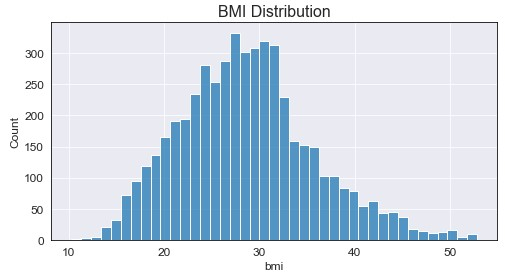

Okay so a bit more normal right? Maybe a little right skew in there too? I'm happy with where that's at. Now that we've handle the *bmi* feature it's time to create our first new feature: weight classes based on patient bmi.

### Weight Class (Feature Engineering)
I decided to create weight classes based on the [National Heart, Lung, and Blood Institute BMI Scale](https://www.nhlbi.nih.gov/health/educational/lose_wt/BMI/bmicalc.htm) which gives us the following categories:

- Underweight = Less than 18.5
- Normal weight = 18.5 - 24.9
- Overweight = 25 - 29.9
- Obesity = Greater than 30

``` Python
def weight(row): # see function.py file for function definition
    if row['bmi'] >= 30:
        val = 'obese'
    elif ((row['bmi'] >= 25) & (row['bmi'] < 30)):
        val = 'over weight'
    elif ((row['bmi'] >= 18.5) & (row['bmi'] < 25)):
        val = 'normal weight'
    else:
        val = 'under weight'
    return val
```
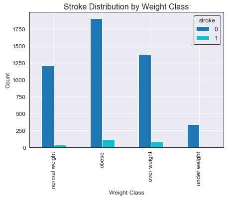

So it seems that the majority of the data falls into the *obese* category, followed by *over weight*, *normal weight*, and finally *under weight*. The majority of strokes seem to occur in for patients that fall under either obese or over weight, some for normal weight, and only a single patient that was under weight. If we look further into this (not shown in this article, refer to notebook) we get the following mean ages for each weight group: normal - 33.76, obese - 49.96, over weight - 49.39, and under weight - 10.91. It seems that older patients, who are also more susceptible to strokes, fall into the obese and over weight classes.

## Age

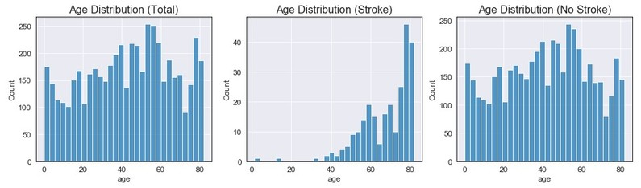

Age does not seem to have a certain type of distribution for all observations (closest to a uniform distribution). When looking strictly at stroke observations, we can see the majority of the data is above 35 and has an extreme left skew. The distribution for no stroke also seems to not have a certain distribution (but could be classified at closely uniform).

### Age Class (Feature Engineering)
Using the Age Categories from the Canadian Statistics website, I created features for the life cycle groupings defined on their website:

- Children (0-14)
- Youth (15-24)
- Adults (25-64)
- Seniors (65+)

I also created a generic *age_class* feature to be used for graphing. Think of the above individual features as a one-hot-encoding of the age_class feature.

``` Python
data['child'] = np.where(data.age < 15, 1, 0)
data['youth'] = np.where(((data.age >= 15) & (data.age < 25)), 1, 0)
data['adult'] = np.where(((data.age >= 25) & (data.age < 65)), 1, 0)
data['senior'] = np.where(data.age > 65, 1, 0)

def age(row): # see function.py file for function definition
    if row['child'] == 1:
        val = 'child'
    elif row['youth'] == 1:
        val = 'youth'
    elif row['adult'] == 1:
        val = 'adult'
    else:
        val = 'senior'
    return val

data['age_class'] = data.apply(age, axis=1)
```
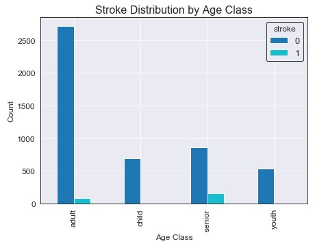

It seems that the majority of the people observed in the data were young adults (25-64). However, people categorized as seniors had the highest amount of strokes. It also looks like both children and youth have very low stroke rates, and looking into this further we can see only two female children (age 1 and 14) had strokes. An important note is that the two children who had strokes were both categorized as obese with a BMI of approximately 30 for both.

## Remaining Features Exploration
The remaining features didn't seem to have too many correlated findings or values that allowed for any feature engineering, so they will be generalized into this section. This will just be a brief overview of a few features, so refer the *stroke_prediction.ipynb* section *Age* & *Other Numerical Features* for a more in-depth exploration.

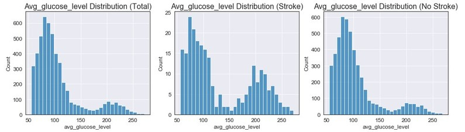

We can see that *avg_glucose_level* doesn't have a certain distribution (could be considered bimodel), and for both stroke/no stroke we have the same findings (with stroke having a slightly higher second peak).

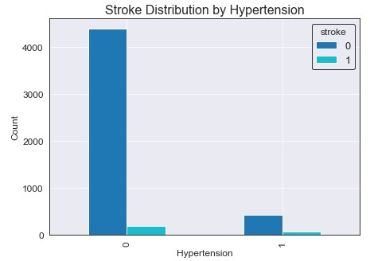

Looking at the above graph, we don't seem to have any clear indicator of *Hypertension* being a key feature for stroke detection. However, if we look at the ratio of stroke to no stroke within the Hypertension classes, we can find that people with Hypertension are about 4x more likely to have a stroke.

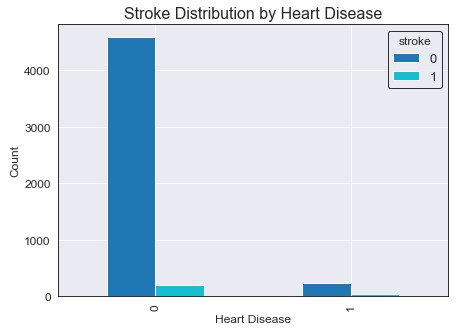

Again looking at the above graph, we don't seem to have any clear indicator of *Heart Disease* being a key feature for stroke detection. However, if we look at the ratio of stroke to no stroke within the Heart Disease classes, we can find that people with Heart Disease are about 5x more likely to have a stroke.

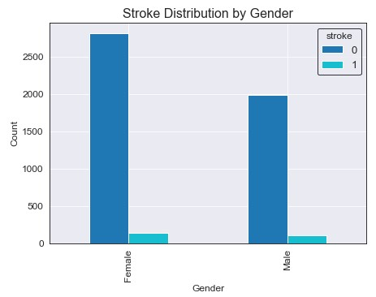

We seem to have around 800 more females than males in our dataset, but the amount of strokes for each gender seem to be about equivalent. Similarly, their ratio in respect to their group total are about equivalent. There is no clear evidence that one gender is more susceptible to stroke then the other.

## Final Data Processing
Now that we have finished exploring the data, we will want to create a final data set that can be used in the modeling section. We will drop all unused features and one-hot-encode the remaining categorical features.

``` Python
# Drop features that wont be used
data.drop(['work_type', 'Residence_type', 'age_class', 'gender'], axis=1, inplace=True)

# Encode and create any new necessary features
data['ever_married'] = data['ever_married'].replace(['No', 'Yes'], [0,1])
data['age_over_45'] = np.where((data.age >= 45), 1, 0)
data['over_weight'] = np.where((data.bmi >= 25), 1, 0)
data['smokes'] = np.where((data.smoking_status == 'smokes'), 1, 0)
data['never_smoked'] = np.where(((data.smoking_status == 'never smoked') | 
                                 (data.smoking_status == 'Unkown')), 1, 0)
data.drop(['smoking_status', 'child', 'youth', 'adult', 'senior', 'weight_class'], 
          axis=1, inplace=True)
```
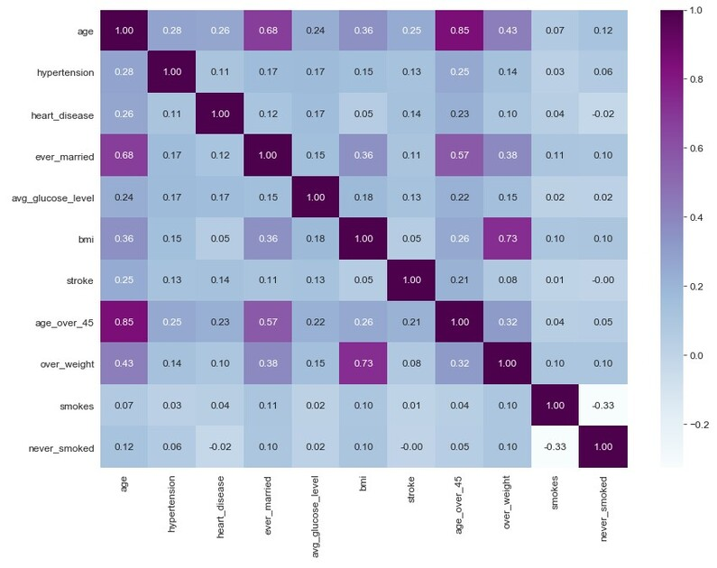

Looking at the above matrix it seems that stroke has the highest correlation with the following features: age (0.25), age_over_45 (0.21), heart_disease (0.14), hypertension (0.13), and avg_glucose_level (0.13). There are other features that are correlated with stroke that we engineered, but are lower than the ones listed previously. Now that our data is processed and a subset of the features are kept, we can begin the modeling section.


# Modeling
### Brief Overview of Data Formatting
For the **Statistical Modeling** section, the data was reformatted in two ways to accommodate the large class imbalance (around 20x more observations of "No Stroke" compared to "Stroke"):

- Training data was balanced by using SMOTE (Synthetic Minority Oversampling Technique) to increased of minority "stroke" class to a 3:4 ratio with the majority class "no stroke". This resulted in around 3400 majority observations (0) and 2500 minority observations (1).

- Testing data was balanced using the NearMiss algorithm, which undersampled the majority class to a 4:3 ratio with the minority class. This resulted in around 120 majority and 90 minority observations to be used for evaluation. *Note: when evaluating based on oversampled data, I did not feel the results were as accurate since repeated observations were increasing the scores. I want the model to be prepared for real world data rather than higher metrics on repeated data.*

For the **Ensemble Modeling** section, the data was reformatted in the following ways to accommodate the class imbalance:

- Training data was left untouched since the ensemble algorithms we used are able to handle the imbalance within the model itself.

- Testing data was resampled so that we would have a "Stroke" to "No Stroke" ratio of 2:3, resulting in around 50 minority and 75 majority observations (slightly smaller than the statistical modeling data).

- An important note is that the extra observations from the majority class (after being undersampled) in the testing data were added back into the training data so that we had more data to train on. This was due to the algorithms being able to handle class imbalance (so more majority observations would not have a negative effect).

## Statistical Modeling
Using the [StatsModels](https://www.statsmodels.org/v0.10.1/) module, I created a Generalized Linear Model based on the Logistic (Binomial) family. Before the actual model can be built, we first need to set up the data splits and sampling methods described above. The following code took care of this:

``` Python
X_train, X_test, y_train, y_test = train_test_split(X, y, test_size=0.3, random_state=42)

over_sampler = over_sampling.SMOTE(sampling_strategy=0.75, random_state=42)
under_sampler = under_sampling.NearMiss(sampling_strategy=0.75, version=2)
X_train, y_train = over_sampler.fit_resample(X_train, y_train)
X_test, y_test = under_sampler.fit_resample(X_test, y_test)

# Create data frame for GLM model (X_train & y_train in same data frame)
data_glm = X_train.copy()
data_glm['stroke'] = y_train
```
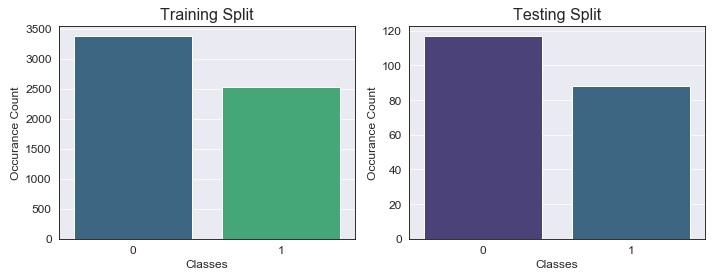

As we can see, by oversampling we were able to bring up the minority class observations to approximately 2500, which gave us our 4:3 desired ratio (again, no real reason why I chose this but let's just go with it). Testing data has also been reduced down to the desired 3:4 ratio. Now that we have our data formatted correctly, we can begin to build our GLM:

``` Python 
response_var = 'stroke ~ ' # Fit with all variables
explanatory_vars = ' + '.join(X_train.columns.values)
formula = response_var + explanatory_vars

model = sm.GLM.from_formula(formula, family=sm.families.Binomial(), data=data_glm)
result = model.fit()
result.summary()
```
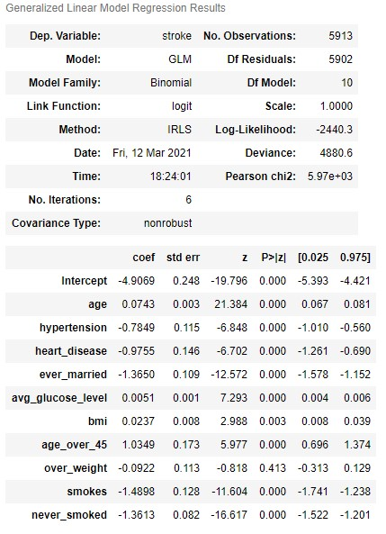

From our initial model, we can see that almost all features are statistically significant (except for *over_weight* which was a feature I had previously created from *bmi*). We can now use the above model to predict on the test data, and we get the following initial (base model) results:

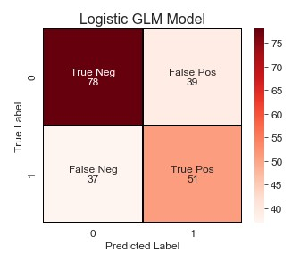

Okay, so not bad. But I'm pretty confident that we can improve these results. How you may ask? Unlike machine learning models, we can use Grid or Random Search with a bunch of hyperparameters. Statistical models require a little more finesse. And by finesse I mean stepwise selection to find the best combination of these features. I'll evaluate these models based on their BIC, Recall, and F-Beta score (beta=0.85 provided the best results).  

> **NOTE**: All 3 stepwise methods resulted in the exact same model, with the same coefficient & p-values. So forward selection will explain in a bit more detail, and then exhaustive/backwards will just be a quick overview of the code and idea behind them.

### Foward Stepwise Feature Selection 
``` Python 
def fitModel(feature_subset):
    response_var = 'stroke ~ '
    explanatory_vars = ' + '.join(X_train[list(feature_subset)].columns.values)
    formula = response_var + explanatory_vars
    model = sm.GLM.from_formula(formula, family=sm.families.Binomial(), data=data_glm)
    result = model.fit()
    y_preds = round(result.predict(X_test[list(feature_subset)]))
    model_recall = recall_score(y_test, y_preds)
    model_fbeta = fbeta_score(y_test, y_preds, beta=0.85)
    return {'model': result, 'bic': result.bic, 'recall': model_recall, 
            'fbeta': model_fbeta, 
            'features' : X_train[list(feature_subset)].columns.values}
            
def forwardSelection(predictors):
    start = time.time()
    remaining_predictors = [p for p in X.columns if p not in predictors]
    results = []
    for p in remaining_predictors:
        results.append(fitModel(predictors+[p]))
    
    models = pd.DataFrame(results)
    best_model = models.sort_values(by='fbeta', ascending=False).iloc[0,:]
    print("Processed", models.shape[0], "models on", len(predictors)+1, 
          "predictors in", round(time.time()-start,3), "seconds.")
    
    return best_model.values
```

Okay so a good amount of code just thrown at you there. The general idea for **forward selection** is that we iterate over all of the features in the training data set with each iteration adding the coefficient that improves our model the best. For each iteration, we try all features but only return a single model that had the highest F-Beta score, and append this to our list of final models. In total, we will have 10 models (given that we have 10 features) which we then plot and choose a final model from. 

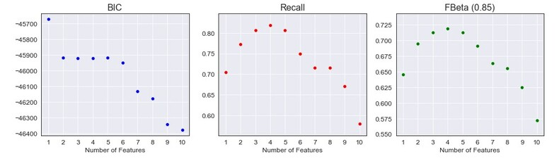

From the above graphs, we can see that the model using 4 features resulted in the highest Recall & F-Beta score (BIC is in the middle, but this model gave the best results). To save space I'll put the results from the model summary and confusion matrix for the test set in the final model section since all 3 stepwise methods resulted in the same model/scores.


### Exhaustive Stepwise Feature Selection
``` Python
def exhaustiveSearch(k):
    start = time.time()
    results = []
    for combo in itertools.combinations(X_train, k):
        results.append(fitModel(combo))
    
    models = pd.DataFrame(results)
    best_model = models.sort_values(by='fbeta', ascending=False).iloc[0,:]
    print("Processed", models.shape[0], "models on", k, 
          "predictors in", round(time.time()-start,3), "seconds.")
    
    return best_model.values
```
The general idea for **exhaustive selection** is that we try every combinations of predictors given a certain length (in this case, 1 through 10) and return the best model. For example, in step 2 we try every combination of 2 features and so on. *Note: forward search took around 1 second for all 10 steps, where exhaustive search took around 25 seconds - for a much larger model this would need to be considered before using.*

### Backwards Stepwise Feature Selection
``` Python 
def backward(predictors):
    start = time.time()
    results = []
    for combo in itertools.combinations(predictors, len(predictors)-1):
        results.append(fitModel(combo))
    
    models = pd.DataFrame(results)
    best_model = models.sort_values(by='fbeta', ascending=False).iloc[0,:]
    print('Processed ', models.shape[0], 'models on', len(predictors)-1, 
          "predictors in", round(time.time()-start,3), 'seconds.')
    
    return best_model.values
```
The final method is **backwards selection**, which will begin with all of our features in the data set, and each iteration it will drop the least significant coefficient. So we start with 10 features, and work our way down to 1 at the end.

### Final Statistical Model
``` Python
models_bwd_flipped.loc[4]['Model'].summary() # final model
```
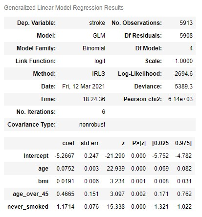

Our final model! Although I'm showing the model from the Backward selection, both the forward/exhaustive models also had the same 4 features as their top performer (so just think of the above as the general winner for each method). All coefficients are now statistically significant, and to my surprise some of what I thought were key features have been dropped. *Hypertension, heart disease, smoking,* and *average glucose level* are key indicators for stroke but they were all dropped? Blows my mind, but our model seemed to perform much better without them and the results below show that:

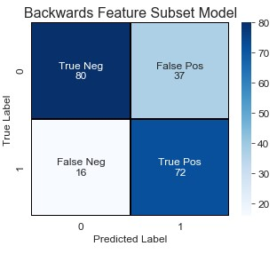

Okay, so what improvements do we have over the base model:

- True Negatives increased by 2, while False Positives decreased by 2 (less people classified as stroke that did not have a stroke). :star:
- False Negative decreased by 21, while True Positives increased by 21 (more people classified as stroke that actually had a stroke). :star:
- Precision increased from 57% to 66%.
- Recall increased from 58% to 82% (this was the most important evaluation metric to improve).
- Accuracy increased from 63% to 74%.

*Note: the above came from the classification report, see either the README.md or stroke_prediction.ipynb*.

A huge improvement! The changes marked by the :star: were our main metrics to improve and we successfully did. There's still room to improve (False Positives could be lowered a bit but this was a trade off to increase Recall) but this is a strong model. However, will it be strong enough to stay champion? Let's move onto the ensemble modeling and see.


## Ensemble Modeling
*To be filled in...*

