> [**Original GitHub Repository**](https://github.com/dhelms1/tidy-tuesday/tree/main/TvGoldenAge)

# Introduction
Welcome! This is the first of many posts for the **#tidytuesday** data exploration project in which I explore a smaller data set with no goal of creating a model but strictly to become more familiar with R and packages such as *dplyr, tidyverse,* & *ggplot*. In this week, we'll explore the IMDb data set that recorded information such as seasons, date, average rating, and shares for TV dramas from 1990 to 2018. The data originated from the [Tidy Tuesday GitHub](https://github.com/rfordatascience/tidytuesday/tree/master/data/2019/2019-01-08) repository.


# Initial Exploration
Reading in the data and displaying the first few rows, we can see:

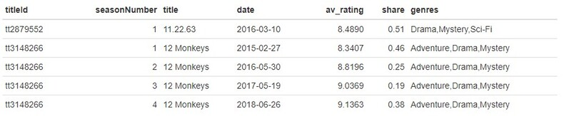

``` R
tv.data <- tv.data %>% select(-titleId) # Drop 'titleId' Column

length(unique(tv.data$title)) # 868 unique shows
```
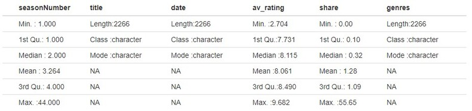

Initially I decided to drop the *titleId* column, as I didn’t see much use for it in the data exploration since we already have *title*. Of the 2266 observations within the data set, there are 868 unique shows. The number of seasons range from 1 to 44 (which we will need to explore this 44 season show to see if it is true). The average rating ranges from 2.704 to 9.682, as well as shares ranging from 0 to 55.65.

``` R
av.plot <- ggplot(tv.data, aes(x=av_rating)) + geom_histogram(bins=40, fill="#DA0A0A") + 
  xlab('Rating') + ylab('') + ggtitle('Average Rating')
share.plot <- ggplot(tv.data, aes(x=share)) + geom_histogram(bins=40, fill="#09C517") + 
  xlab('Share') + ylab('') + ggtitle('Share')
season.plot <- ggplot(tv.data, aes(x=seasonNumber)) + geom_histogram(bins=40, fill="#0A75DA") + 
  xlab('Seasons') + ylab('') + ggtitle('Number of Seasons')
grid.arrange(av.plot, share.plot, season.plot, ncol=3)
```
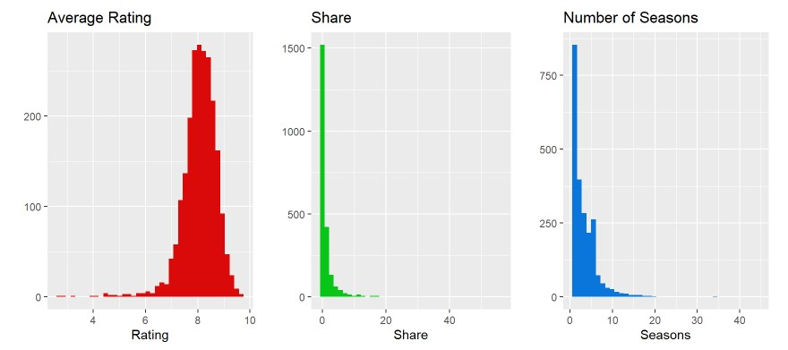

# Month, Day, & Year: Creation/Exploration
``` R
tv.data <- tv.data %>% mutate(year = year(date),
                              month = month(date),
                              day = day(date)) %>% select(c(1,2,3,7,8,9,4,5,6))
```
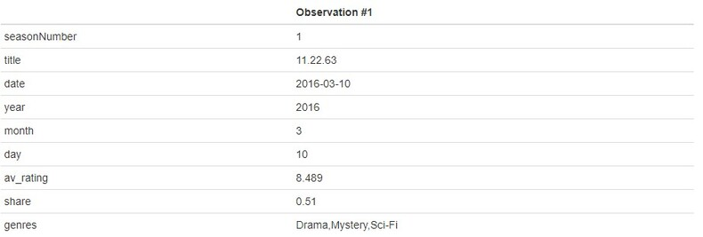

I decided to split the date feature into 3 subset features: *year*, *month*, and *day* using the [lubridate](https://lubridate.tidyverse.org/) package. This will make exploration easier for me later on where I can group by year or month rather than date strings. I also reordered the columns to put these after the date feature instead of the end of the data frame cause my OCD didn’t like how it looked…

### Year
``` R
ggplot(tv.data, aes(x=factor(year))) + geom_bar(fill= "#FF6666") + 
  ylab('Year Occurance') +  xlab('Year') + ggtitle('Year Occurance Distribution') + 
  theme(axis.text.x = element_text(angle = 90, vjust = 0.5)) + 
  geom_text(aes(y=..count.. + 8, label=..count..), stat='count', size = 3)
```
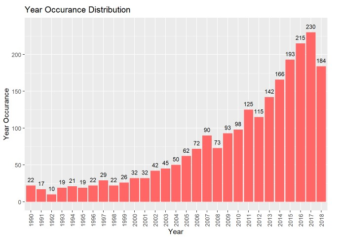

It seems that the occurrence for years is extremely right skewed, almost growing exponentially (the last date is 2018-10-10, so we are missing around 2.5 months of data for 2018). We'll now want to explroe the average rating for each year to see if it increases/decreases as more shows seem to be coming out (maybe more isn’t always better).

``` R
tv.data %>% select(year, av_rating) %>% group_by(year) %>% summarize(average_rating = mean(av_rating)) %>% 
  {ggplot(., aes(x=factor(year), y=average_rating)) + geom_point(color= "#FF9333", size=3) + 
      geom_hline(yintercept=8, color='red', alpha=0.5) + geom_vline(xintercept=12, color='blue', alpha=0.5) +  
      xlab('Year') + ylab('Average Rating') + ggtitle('Average Yearly Rating') + 
      theme(axis.text.x = element_text(angle = 90, vjust = 0.5)) +
      geom_text(aes(label=sprintf("%.2f", average_rating), y=average_rating + 0.03), size=2.8, vjust=0.3)}
```
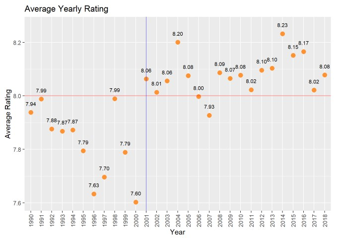

Looking at the average rating for each year, it seems the values range from 7.60 (in 2000) to 8.20 (in 2004). For the most part, there are no standout years in which extremely high/low ratings were present. For the most part, it seems that shows prior to 2001 had lower average ratings (all below 8) and almost all shows after 2001 had above an average rating of 8 (excluding 2007 which had a 7.93). If we think of the above graph as being split into the usual graph quadrants (I, II, III, IV), we can see that the majority of the data after 2001 is in quadrant I and all data prior to 2001 is in quadrant III.

### Month
``` R
ggplot(tv.data, aes(x=factor(month))) + geom_bar(fill= "#3396FF") + ylab('Month Occurance') + 
  xlab('Month') + ggtitle('Monthly Occurance Distribution') +
  geom_text(aes(y=..count.. + 20, label=..count..), stat='count', size = 4)
```
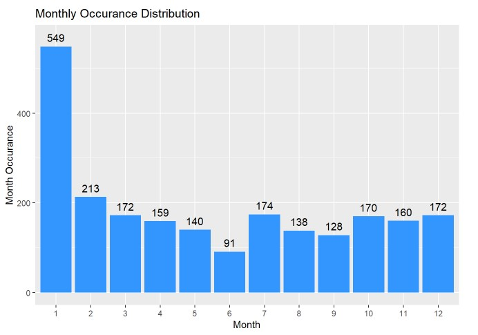

Although this doesn’t tell us too much about the data, is seems that the majority of shows in our data set premiere in January, with most months holding somewhat steady in the 130-210 range (except for July).

# One-Hot-Encoding for Genres
``` R
genres.types <- unique(unlist(strsplit(unlist(unique(tv.data$genres)), ',')))
tv.data[genres.types] <- rep(NA, nrow(tv.data))

for (idx in 1:nrow(tv.data)) {
  tv.data[idx, genres.types] <- as.numeric(genres.types %in% 
                                           unlist(strsplit(tv.data$genres[idx], ',')))
}

kable(t(tv.data[1,]), col='Observation #1')
```
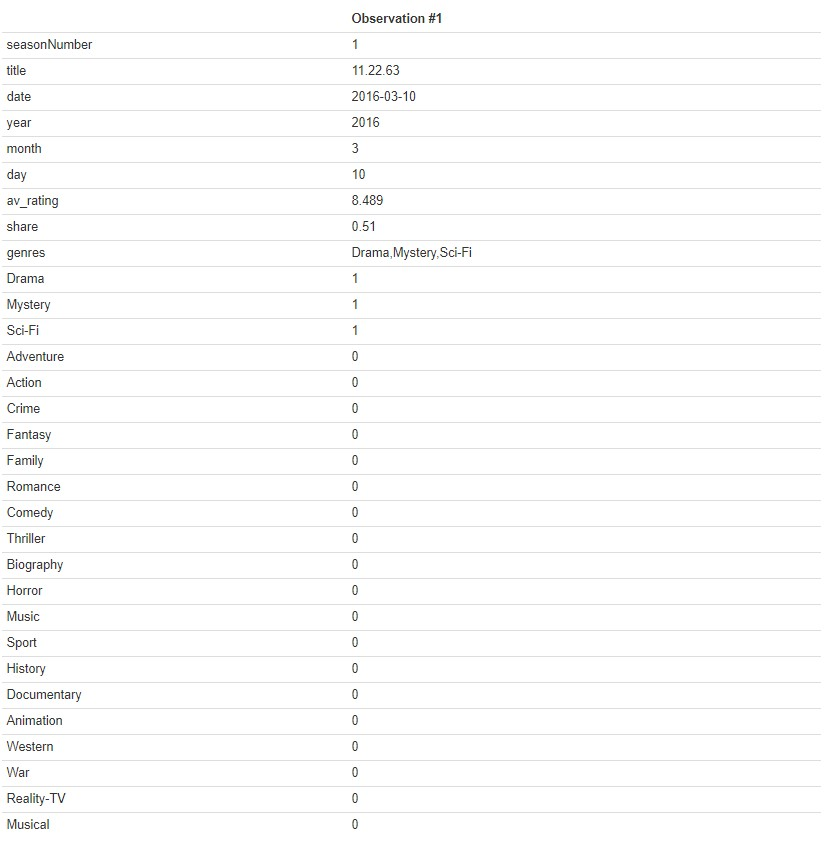

The original genres feature was a single string that listed all genres only separated by a comma. There probably is a fast way out there (or a package that could handle this for me) but my method still only took a few seconds to run so I’m not too worried about optimizing it. I initially got all unique genres strings from the data frame, which I then split on the commas, and finally only kept the unique values from this split (which was 22 total genres). I then created empty columns, looped over all rows for the given columns, and one hot encoded the features to have a 1 is the genre feature contained any of the given genres and a 0 if it does not. I was having an issue of the values being filled column wise, so looping across rows allowed me to fill by rows rather than columns (again, may not be the best way to do it but it still executed quickly so I’ll go with it).

### Most Common Genres
``` R
data.frame(genres=all_of(genres.types),
           appearences=unname(tv.data %>% select(all_of(genres.types)) %>%
                                colSums())) %>% slice_max(appearences, n=length(genres.types)) %>%
  {ggplot(., aes(x=factor(genres, levels= genres), y=appearences)) +
      geom_col(fill="#48BF04") + xlab('Genre') + ylab('Appearences') +
      ggtitle('Number of Appearences Per Genre') +
      theme(axis.text.x = element_text(angle = 90, vjust = 0.5)) +
      geom_text(aes(label=sprintf("%.0f", appearences), y=appearences + 50), size=3, vjust=0.3)}
```
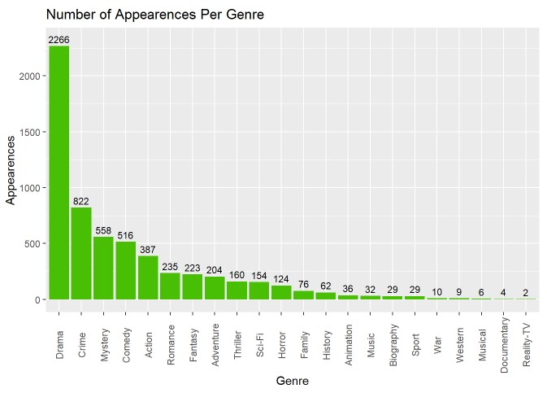

From the above graph, we can see that “Drama” appears in every TV show genre description (which makes sense since the data set itself covers TV dramas from 1990 to 2018). Following this we can see that “Crime”, “Mystery”, and “Comedy” are the next most common sub-genres (since every show is also a Drama). An idea we may want to explore is whether we can condense these sub-genres down into more broad categories (i.e. combine genres like Action/Adventure or Thriller/Horror) and see how this effects the above graph.

### Average Rating Per Genre
``` R
data.frame(genres=all_of(genres.types),
           avg_ratings=(tv.data %>% select(all_of(genres.types)) %>%
                          mutate_each(funs(.*tv.data$av_rating)) %>%
                          colSums()) / (tv.data %>% select(all_of(genres.types)) %>% colSums())) %>%
  {ggplot(., aes(x=genres, y=avg_ratings)) + geom_point(color="#8F0ADA", size=3) + 
      xlab('Genre') + ylab('Avg Ratings') + ggtitle('Average Ratings Per Genre') +
      theme(axis.text.x = element_text(angle = 90, vjust = 0.5)) +
      geom_text(aes(label=sprintf("%.2f", avg_ratings),y=avg_ratings + 0.18), size=3, vjust=0.3)}
```
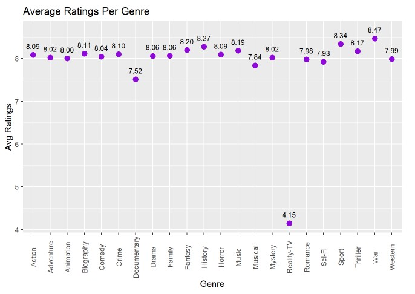

I’m not gonna say I called this one but just look at “Reality-TV”… If you’ve ever seen an episode of *Keeping up with the Kardashians* or *Real Housewives of any major city in America* then you’d agree with that number. But besides that, it seems that most fall into the average range of 7.5 to 8.5 (a more reasonable number). It seems that surprisingly, TV shows relating to “War” are the highest rated, followed by “Sports” and “History”. Near the bottom, but not nearly as bad as Reality-TV, we have “Musical” and “Documentaries” coming in last place.

# Show Exploration

### Top 20 Highest Rated Shows
``` R
tv.data %>% select(title, year, av_rating) %>% group_by(title) %>% 
  summarize(avg_rating=mean(av_rating), year=floor(min(year))) %>% 
  slice_max(avg_rating, n=20) %>% mutate(title=paste(title,'(', year, ')')) %>%
  {ggplot(., aes(x=fct_rev(factor(title, levels=title)), y=avg_rating)) +
      geom_col(fill="#09C59D") + xlab('') + ylab('Average Rating') + ggtitle('Top 20 Shows Average Ratings') +
      geom_text(aes(label=sprintf("%.2f", avg_rating), y=avg_rating + 0.3), size=3, vjust=0.3) + coord_flip()}
```
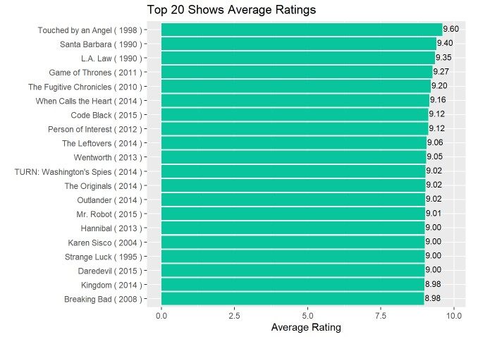

Looking at the above graph, we can see that the 3 highest rated shows are all from the 1990’s (which is surprising given the earlier findings that shows prior to 2001 average ratings below 8.0). However, 16 of the 17 other top 20 shows are all post-2001, which validates our earlier findings. And even further, all of these shows are post-2010, which again makes sense since 2010+ had the highest average yearly ratings for TV shows from earlier findings.

### Top 20 Most Shared Shows
``` R
tv.data %>% select(title, year, share) %>% group_by(title) %>% 
  summarize(avg_sharing=mean(share), year=floor(min(year))) %>% 
  slice_max(avg_sharing, n=20) %>% mutate(title=paste(title,'(', year, ')')) %>%
  {ggplot(., aes(x=fct_rev(factor(title, levels=title)), y=avg_sharing)) +
      geom_col(fill="#C50981") + xlab('') + ylab('Average Sharing') + ggtitle('Top 20 Shared Shows') +
      geom_text(aes(label=sprintf("%.2f", avg_sharing), y=avg_sharing + 1.2), size=3, vjust=0.3) + coord_flip()}
```
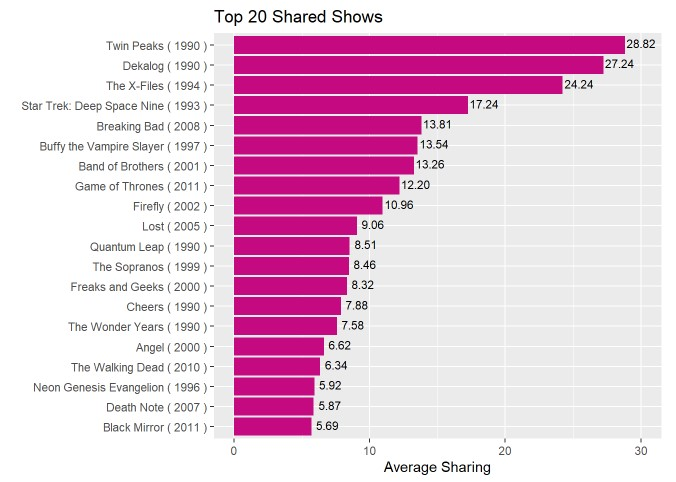

Looking at the above graph, similar to the top 20 highest rated shows, the top 3 are all 1990’s era. On top of this, there seems to be an even distribution of 1990’s and 2000’s shows, which leads me to wonder if there are less shares for shows as years increases? There also does not seem to be much overlap with shows that have high rating and shows with high shares (maybe people already know about the high rated shows so they are shared less?).

### Yearly Average Share
``` R
tv.data %>% select(year, share) %>% group_by(year) %>% 
  summarize(yearly_shares = mean(share)) %>% 
  { ggplot(., aes(x=factor(year, levels=year), y=yearly_shares)) + 
      geom_point(color="#09C59D", size=3) +
      xlab('Year') + ylab('Average Yearly Share') + ggtitle('Average Share per Year ') +
      theme(axis.text.x = element_text(angle = 90, vjust = 0.5)) +
      geom_text(aes(label=sprintf("%.1f", yearly_shares),y=yearly_shares + 0.4), size=3, vjust=0.3)}
```
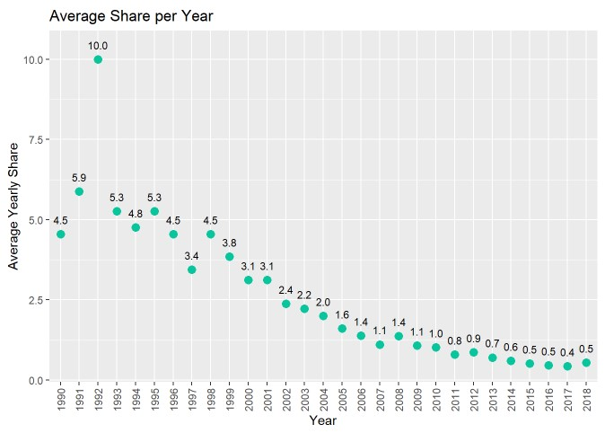

My question from the previous section was correct: It does seem that as we progress through the years, people are sharing shows less. This is an interesting finding since it would seem today we have easier ways to share shows: social media, texting, etc. Maybe with all these new inventions there is less human interaction, but who knows.

# Conclusion


Overall, the findings from this project were very interesting. Seeing how more shows began to occur as the years increased was expected, with platforms such as YouTube, Netflix, Hulu, etc. And average rating increasing as years increased was also not a suprise, as I expected the more "modern" shows would have slightly better overall production. However, it was interesting to see that the top 3 shows with the highest average rating were all from the 1990's as well as the top 4 shared shows being from the same era. With average shares decreasing as the years increased, could this be due to more shows being produced and therefore less average shares per show? Further exploration will be needed to answer this question, but our main question here is "Does TV have a golden age?". From the data, if we used average yearly rating we could say yes; and it's currently happening right now. However, if we used yearly shares and highest rated shows then we could also say yes; during the 1990's shows were at their peak of being talked about among people and could be considered the Golden Age of television. This question is up to the individual to answer, and it all depends on what one would consider *The Golden Age*. 


