> [**Original GitHub Repository**](https://github.com/dhelms1/gpu_scraping)

# So Close... Yet So Far 
If you're reading this, then most likely you too have some type of interest in machine learning or data science. And you know that GPUs are amazing for speeding up the processes you do in this fields, especially for Deep Learning. However if you're currently in the market for one of these GPUs, especially the new NVIDIA RTX Series which would be PERFECT for Deep Learning projects, you know how impossible it is to find one of them (special thanks to all the crypto miners and resellers out there). So I figured if I can't have one, might as well scrape Newegg for information on a bunch of different graphics cards and do some Data Analysis right? Not my first though, but it did sound like an interesting project. And although I initially wanted to implement it in Python, I figured this would be a great learning opportunity for R especially given my current internship. And so here we are, scraping Newegg for information on GPUs while I patiently wait for them to become available.

In my many hours of searching the internet about the rules of web scraping and if certain website allow it or not, I find myself asking "Am I really suppose to be doing this?". Some people say no, some say it's fine, others just avoid the question and continue their work. I still don't have the answer to this question, but in my attempt to collect the data as ethically as possible I've taken the following steps:

- Only creating requests ~2 times per day, spaced out by a few hours.
- Keeping the data private on my computer and not uploading for public use.
- No private information is being collected, only product details.

Each page on Newegg has around 36 results, and even though it has hundreds of pages I only scraped 10 of them over the span of 5 days. I didn't want to create too many requests and overload their site, so I tried to minimize the amount of time I spent sending requests. Hopefully this is ethical, and if not then this all was just hypothetical.

# The Scraping Script
So basically there are three main categories for which data was scraped: Model Specs (Brand, Series, Memory, etc.), Ratings (Average & Total Number), and Pricing Information (Price, Sale, & Shipping). I'll break down each of these, and the exact code used to collect the data.

Just a quick note, a lifesaver for this project was the [SelectorGadget](https://rvest.tidyverse.org/articles/selectorgadget.html) from Rvest and part of the tidyverse. Basically instead of having to inspect elements using html code, this allowed me to find css selectors in the page that I needed and extract them below (these are the string passed to the *html_nodes()* functions). 

## GPU Specs
``` r
get_model_info <- function(gpu_link) {
  cols <- c('Brand', 'Model', 'Chipset Manufacturer', 'GPU Series', 'GPU', 'Core Clock', 'Boost Clock', 
            'Memory Size', 'Memory Interface', 'Memory Type', 'Date First Available')
  model_info <- read_html(gpu_link) %>% 
    html_nodes("table , #product-mini-feature .tab-nav:nth-child(2)") %>% html_table(fill=TRUE)
  info_df <- data.frame(tmp=t(do.call(rbind, model_info))) %>% row_to_names(row_number = 1)
  for (cname in cols) {
    if (cname %notin% colnames(info_df)) {
      info_df[cname] <- rep(NA, nrow(info_df))
    }
  }
  info_df[cols]
}
```
So the first piece of information I wanted to pull were specs for each GPU (described in the cols variable above). This wasn't too hard to complete, the string in *html_nodes()* navigates to the specs tab and pulls the entire table from the website. I then collapsed this into a data frame, and if the specs tab was missing one of the desired pieces of information (from the cols variable), then I would fill the column with NA. The function returned a data frame with the select columns, which was then added to a larger data frame which I will describe later in the Data Collection section.

## GPU Ratings
``` r
get_gpu_ratings <- function(gpu_link) {
  data.frame('AvgRating' = substring(unlist(strsplit(as.character(read_html(gpu_link) %>% 
                              html_nodes(".product-rating")), "rating rating"))[2], 10, 30),
             'NumberOfRatings' = read_html(gpu_link) %>% html_nodes(".product-rating .item-rating-num") %>% 
                                    html_text() %>% .[1])
}
```
Now this... This was true pain to get working. If only Newegg had a normal rating system like every other website out there. But of course they have to put their ratings as "eggs", which is creative I will say, but also made pulling this information ridiculously long. I don't expect the above code to make much sense (it doesn't really to me and I'm the one who wrote it), but basically I had to read through the raw data without converting it to readable text using *html_text()*. I couldn't just index it either because each rating appeared at a different point for each gpu. However, the work around this was to split the raw data at the *rating rating* tag and take the second object, which I then subset ranging from index 10 to 30 to produce this: `="5 out of 5 eggs"></`. 
This is an example of rating for a "5 star" product, which I will now need to clean but that will occur later during the Data Processing section (I probably could have decreased the index range, but I wanted to keep a buffer just in case). Getting the Number of Ratings was much easier, just converting to readable text and taking the first item. I'm just glad this part is over, and now we can move onto the Pricing script code.

## GPU Pricing
``` r
get_gpu_pricing <- function(page_link) {
  page <- read_html(page_link)
  tmp_df <- data.frame('Price' = page %>% html_nodes('.price-current') %>% html_text())
  tmp_df$CurrentSavings <- page %>% html_nodes('.price-save') %>% html_text()
  tmp_df$Shipping <- page %>% html_nodes('.price-ship') %>% html_text()
  tmp_df
}
```
We go from the hardest to now the easiest piece of code in this entire project. I wish everything was this straight forward, just a simple css selector and converting to it text and we have all the variables we need. I pulled the current price, the savings tag (saying how much % off an item was), and the shipping cost (either "Free" or Numeric value). Originally I had tried to also get the original price before it was put on sale and create a new column, where I'd fill it with the current price if not on sale and the sale price if on sale but this gave me a lot of issues. The original prices was a different size vector each time and trying to input them was taking more time than I'd like to admit, so I skipped this and just stuck with the current price.

## Data Collection
So as I had previously stated earlier, the data was gathered over a number of days since I only wanted to send a few requests per day. Around 2 pages were scraped per day for a total of 356 observations over the collection period. To save some room I won't include all the code used to gather and combine the data into a single data set, but the general idea was that I created an empty data frame for each script above. I then bind the returned values by rows into a data frame, which then contained 36 observations and the corresponding number of features from above. Below is the code used to do this:

I would then read in the previously saved raw data, create a new data frame that matched the current layout of the raw data, and then would row bind the two data frames together into a new raw data set. This would be saved, and the process would be repeated for each page (since they were spaced out). At the end of the process, I ended with 356 total observations with 18 features. However, this data was not at all ready to be used for Exploration or Modeling, and that brings us to the cleaning script.

# Data Cleaning :heart: RegExp
Okay so maybe not, but there was a good amount of regular expression's used to clean the data. I guess it could be seen as a good thing, but everything read in from the scraping script was put into the data frame as a character. Lot's of which held the numeric values somewhere in a string, such as:

`"1241 MHz (OC Mode)1190 MHz (Gaming Mode)1127 MHz (Silent Mode)"`

All I wanted was the core clock speed, but this is what I got instead. And yes I thought maybe split it and index, but of course Newegg likes to change the order in which they list the modes so I couldn't do that. But that's besides the current point. I had all the data ready and it's time to get it in the correct format and create any new features that would be necessary. My goal is to maintain around 300 observations (hence why I scraped a little extra) after cleaning up the data. Just for ease of reading and my own sanity, I'll split up the cleaning based on the scripts above.

## GPU Spec Cleaning
Luckily, a few features of this data could be left as characters and didn't need much cleaning (*Brand*, *Model*, *GPU Series*, *GPU*, *Memory Interface*, & *Memory Type*). Other features like *Chipset Manufacturer* and *Memory Size* only had slight cleaning done to them (Chipset had a single value filtered out and Memory Size was filtered to only keep memory measured in GB, which was all but 4).

#### Clock Speeds
``` r
raw.data <- raw.data %>% 
  mutate(tmp=regmatches(Core.Clock, gregexpr("[[:digit:]]+", Core.Clock)),
         Core.Clock=as.numeric(lapply(tmp, min)),
         OC.Core.Clock=as.numeric(lapply(tmp, function(x) ifelse(length(x) > 1, max(x), NA)))) %>% 
  select(-tmp) %>% select(Page:Core.Clock,OC.Core.Clock,Boost.Clock:NumberOfRatings)

raw.data <- raw.data %>% 
  mutate(tmp=regmatches(Boost.Clock, gregexpr("[[:digit:]]+", Boost.Clock)),
         Boost.Clock=as.numeric(lapply(tmp, min)),
         OC.Boost.Clock=as.numeric(lapply(tmp, function(x) ifelse(length(x) > 1, max(x), NA)))) %>% 
  select(-tmp) %>% select(Page:Boost.Clock,OC.Boost.Clock,Memory.Size:NumberOfRatings)
```
So now as I had pointed out earlier, the clock speeds (both core and boost) had been read in as strings. But of course there were multiple values that had to be parsed, which were then extracted into lists of numbers. I decided on the following methods for both the core and boost clock speed features:

- **Base**: taking the minimum gave the the lowest measurement within each row, so I just assumed this as the "base" value.
- **OC**: the overclock value was a little more tricky. I couldn't just take the max because then GPUs that couldn't be overclocked had their base value in the OC feature. The solution to this was to ensure there was more than one value in the feature, and if true then we took the max (otherwise we filled in with NA).

#### Month/Year
``` r
raw.data <- raw.data %>% 
  mutate(Date.First.Available=as.Date(raw.data$Date.First.Available, format = "%B %d, %Y"),
         Month=month(Date.First.Available),
         Year=year(Date.First.Available)) %>% select(-Date.First.Available) %>%
  select(Page:Memory.Type, Month, Year, Price:NumberOfRatings)
```
Not too much cleaning here either. The original format for the date feature was "Month Day, Year" which needed to be converted to "YYYY-MM-DD" before using the lubridate functions. After this, I created features for the Month and Year it was first available (both numeric) then dropped the original Date feature.


## GPU Rating Cleaning
#### Average Ratings
``` r
raw.data <- raw.data %>% 
  mutate(AvgRating=as.numeric(lapply(AvgRating, function(x) unlist(regmatches(x, gregexpr("[0-9]", x)))[1])))
```
As I had said earlier, the Average Ratings were in a bit of a strange format. Each review had the form `=“[ ] out of 5 eggs”></` where [ ] refers to the Average Rating. To get this value, I used a regular expression to get the first numeric value appearing in the string, unlisted it, and converted to numeric. Voila, we now have our rating in the correct format.

#### Number of Ratings
``` r
raw.data <- raw.data %>% 
  mutate(NumberOfRatings=as.numeric(gsub("\\(|\\)", "", NumberOfRatings)))
```
Another simple cleaning, the number of ratings had parentheses around them and so I substituted either "(" or ")" with "" to remove them and convert to numeric.

## GPU Pricing Cleaning
#### Price
``` r
raw.data <- raw.data %>% 
  mutate(Price=as.numeric(lapply(Price, function(x) gsub("\\$", "", unlist(str_split(x, '\\s+'))[1]))))
```
This one was a little tricky, but the Price feature had the following initial format `$1,061.99 (11 Offers)–`. The way I handled this was to split on the space and take the first element from this vector, which I then substituted the "$" for empty space and finally converted the values to numeric. Initially I had wanted to extract the numeric values similar to ratings above, but this also split on the period and I was losing the cent values. 

#### Current Savings
``` r
raw.data <- raw.data %>% 
  mutate(tmp=gsub("%", "", regmatches(CurrentSavings, gregexpr("[0-9]*%", CurrentSavings))),
         CurrentSavings=as.numeric(lapply(tmp, function(x) ifelse(rlang::is_empty(x), NA, x)))) %>% select(-tmp)
```
At first this one was also a little tricky, as there were two values formats this feature had: `Save: 14%` and `Sale Ends in 7 Hours - Save: 8%`. So again I couldn't just take the first number, and the solution for this was to look for patterns that were numeric and followed by a % sign. I then removed the % sign, filling non-sale items with NA, and finally converted to numeric.

#### Shipping Fees
``` r
raw.data <- raw.data %>% 
  mutate(Shipping=recode(Shipping, "Free Shipping" = "0"),
         tmp=ifelse(Shipping != "0", regmatches(Shipping, gregexpr("\\$[0-9]*.[0-9]*", Shipping)), Shipping),
         Shipping=as.numeric(gsub("\\$", "", tmp))) %>% select(-tmp)
```
This one wasn't too bad either, a lot of the GPUs had free shipping (which I replaced with 0 since there was no cost). The general format for this feature was `$39.99 Shipping`, so I used a regular expression to find a pattern of `\\$[0-9]*.[0-9]*`. I then stripped the $ off of the string and converted to numeric.

### Final Cleaning (NA Filtering)
``` r 
raw.data <- raw.data %>% mutate(na.percent=round(rowSums(is.na(.))/ncol(.), 4)*100) %>% 
  filter(na.percent < 30) %>% select(-na.percent)
```
The final step. Although I don't have a solid reason as to why I chose to keep all values with less than 30% of their data missing, that's what I chose to do. Doing this took away the most observations of all the data cleaning, pushing us from 351 to 288 final observations.

So a bit under my initial goal, but close enough. We now have 288 observations with 21 features that are ready to be explored.

# Data Exploration
Okay so I know I said that I wasn't going to upload the data for privacy reasons, but I figured showing a few observations would be fine (just to get a feel for the general layout of the data).

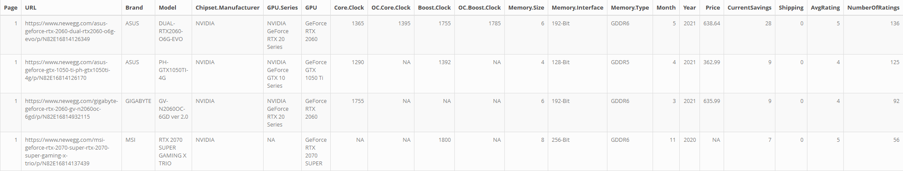

This is the final cleaned data, and it's ready to explore. I'll go over a few of the main features in the data set and some aggregated graphs/tables. The main purpose of this project was web scraping and data cleaning, but it's also important to actually use the data in exploration.

## Brands 

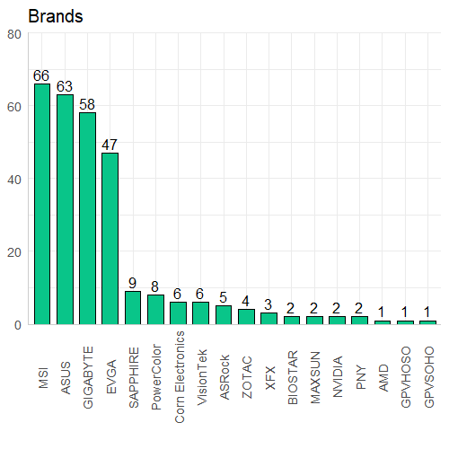 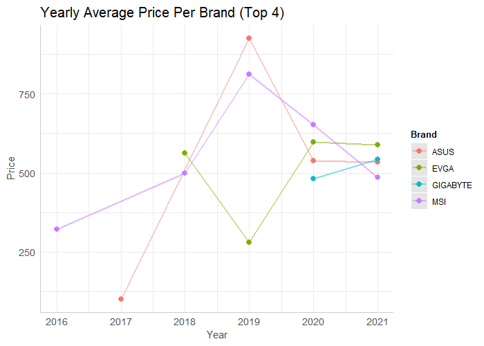 

As we can see, mainly 4 brands are responsible for the majority of the GPUs within our data. MSI, ASUS, GIGABYTE, and EVGA have a clear lead on the number of GPUs present on NewEgg. If we were to look at the average price over the past few years for each of these brands, there is no clear pattern but it does seem that in 2021 and 2021 the average prices seem to be stabilizing and within approximately \$100 of each other. One more aspect I wanted to look at is the average review for each brand:

| Brand    | Rating |
| -------- | ------ |
| EVGA     | 4.52   |
| ASUS     | 4.35   |
| MSI      | 4.32   |
| GIGABYTE | 4.20   |

Although there is now huge difference in rating either, EVGA does seem to be the leader by a bit. ASUS and MSI and nearly tied, and GIGABYTE trails behind them by a small amount. 


## GPUs

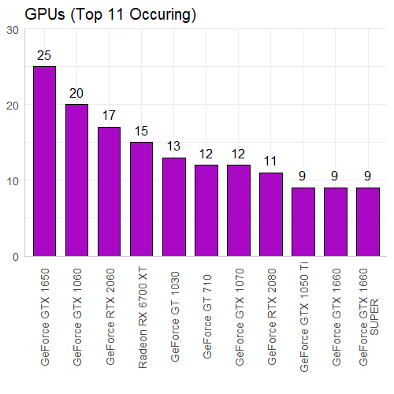 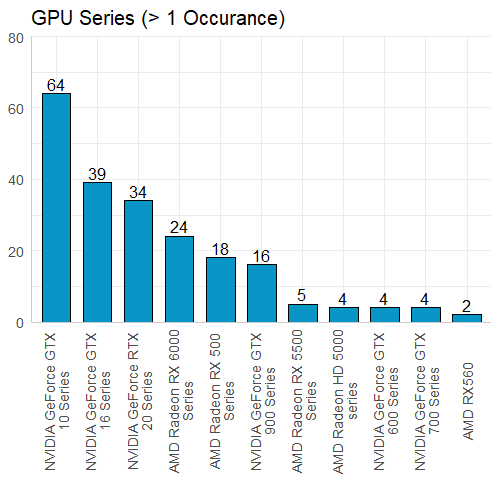 

If we look at the most common GPUs in our data set we can see the majority of them are GeForce, with only the Radeon RX 6700 XT being in the top 11. However this does not carry over to the most common GPU Series, which seems to be split 6 to 5 for NVIDIA and AMD (respectively). The GTX 10 Series is the most common, which makes since given how long they have been on the market. I also wanted to look into the highest rated GPUs:

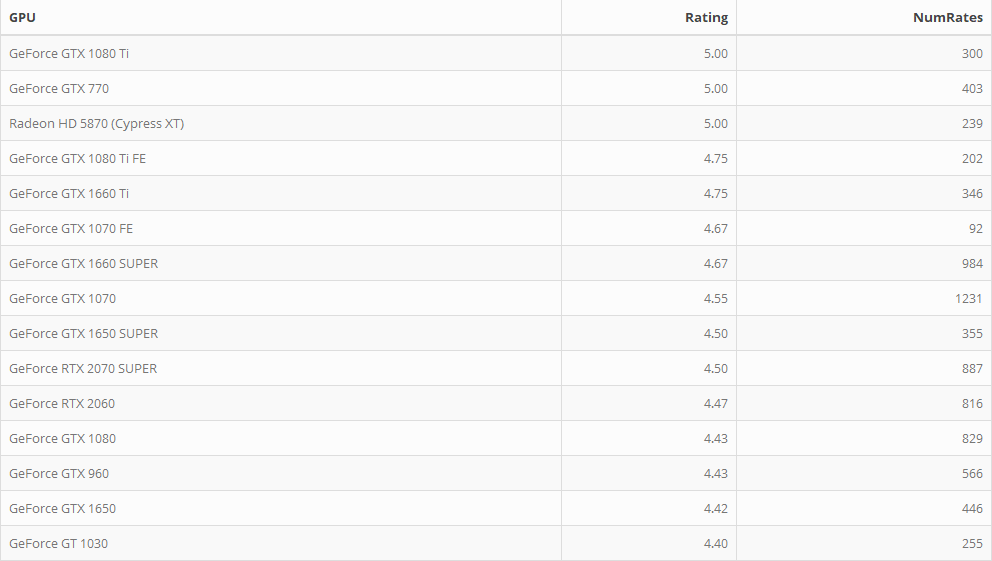 

The top 15 rated GPUs (for the most part) all fall under the GeForce Series, except the Radeon HD 5870. Which is an interesting find because it only has 1 GB of memory size, cost \$325, and does not have good performance (from what I saw on YouTube it was averaging below 30 FPS on many modern games). Yet there are 239 reviews with an average of 5 stars... Maybe there's something I'm missing here but that blows my mind. Besides that, many of these remaining GPUs are still popular to this day being in the GTX 10, 16, and 20 Series. I also filtered these results to have at least 30 ratings since GPUs, with let's say 3 total ratings of 5 stars, aren't as reliable to be "top rated". 

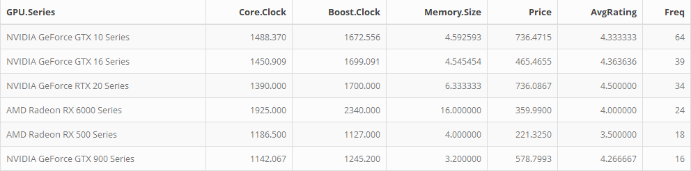

I also pulled an average overview of the specs for the 6 most common GPU series in the data. Although the NVIDIA cards seem to be more expensive than AMD, they also have a higher average rating. If memory size was essential, the AMD RX 6000 Series average 16 GB for only \$360 which seems like a really good deal (but AMD also isn't compatible with CUDA so keep that in mind).


## Clock Speed

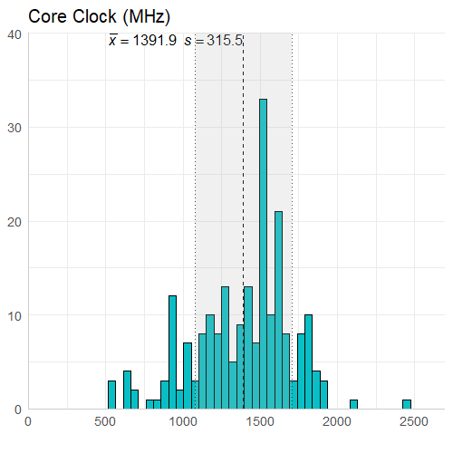 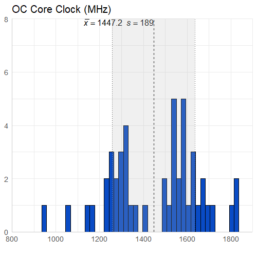

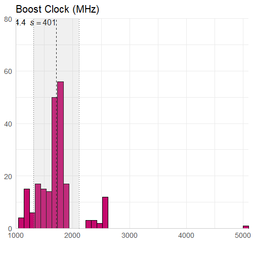 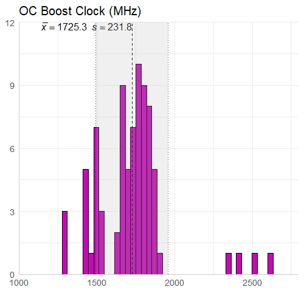 

There really isn't too much to say about this information. The core clock speed is less than the boost clock speed on average (expected), and the overclocked core clock speed is less than the overclocked boost clock speed on average (expected). I did however have to look into the boost clock value of 5000 MHz, which belongs to the AMD FirePro V7900 and was not an error (which I thought it was). It goes from a core clock of 1250 MHz to a boost clock of 5000 MHz, which is also interesting given it only has 2GB of memory size.

## Price

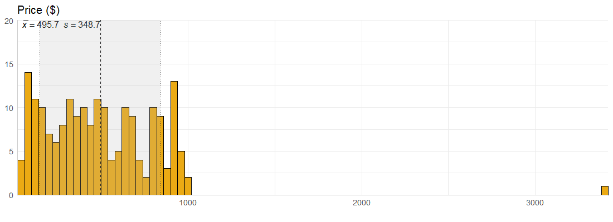

For the most part, the majority of GPUs in the data are below \$1000 and seem to cost an average of roughly \$500. However, we have a single observation for a GPU that costs over \$3000. This had me wondering, what on Earth could cost that much money? Which brought me to examine the 15 most expensive GPUs in the data:

 

I also explored the most expensive GPUs, which is completely dominated by the TITAN V. 12 GB of memory size, 1460 MHz boost clock speed, and uses NVIDIA chipset... A bit pricey but understandable. Besides that outlier, the most expensive GPUs in our data set (on average) seem to fall into th \$620 to \$870 range and again, the majority of them are GeForce cards. 


# Conclusion

Overall this project had taught me a ton. Learning to understand html code a bit more has been super helpful in also changing some things in my website. Learning how exactly to scrape data off a website was also a lot of fun, trying this out with a deep learning project in Python where I pull reviews and try sentiment analysis on it might be an interesting idea to explore. Cleaning the data... between this and my work right now I'm not sure how much more data cleaning I'd want to do for a while, but it's nice to see the end product so that makes it worth it. Exploring these GPUs has been a very interesting project, I didn't realize how many different types of GPUs there are and all the different specs (memory type, clock speed, memory interface, etc.). I'll definitely want to come back to this data eventually and see if some type of model can be built from it, but that will have to be for a later date.


